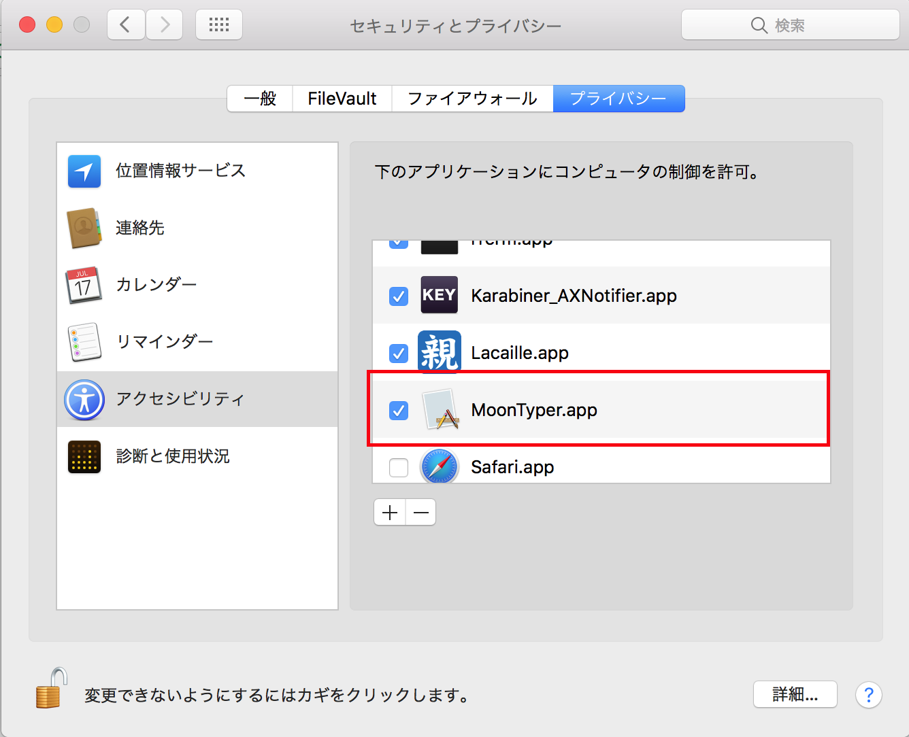
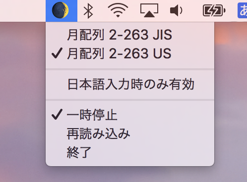

# MoonTyper

月配列, AZIKなどのキー配列でタイピングゲームを遊ぶためのmac向けエミュレータです。

入力キーを、ローマ字入力キーに変換します。

入力する文字が確定した時点ではじめて対応するローマ字のキーを発火します。例えば濁点、半濁点は清音に後置の場合、「は」を入力した時点では「は」なのか「ば」なのか「ぱ」なのか確定しないため、「は」の入力後に何かしらのキーを押した際に初めて「は」（もしくは濁点を押した場合は「ば」）を出力します。

入力の最後が「は」などの未確定の文字の場合スペースなりエンターなりを押して入力を確定させてください。

## 対応OS

- macOS Sierra 10.12以降

## インストール

https://github.com/taisukeh/MoonTyper/releases
から最新の `MoonTyper.app` をダウンロードして展開します。

## 使い方

起動後アクセシビリティを許可してください。



メニューアイコンから使いたいキー配列を選択します。


タイピングゲームで高いスコアを叩き出しましょう！

## 設定ファイル

ホームディレクトリの `~/MoonTyper` ディレクトリ以下に [YAML](https://ja.wikipedia.org/wiki/YAML)形式で月配列の定義を置きます。

```
name: "<表示名>"
keyboard: "<JIS or US>"
keymap:
  # 左が月配列で打つキー名、右がローマ字入力のキー
  "kf": "a"
  "df": "a"
  "i": "i"
  "j": "u"
p  "du": "e"
```

## 補足

2-263でしか試していないため他の月配列の定義に現在の実装で対応できているかわかりません。

こういった点を含め不具合などはissueで報告いただけるとありがたいです。

## 謝辞

このソフトウェアは
https://github.com/ToQoz/SandS
を元に作成しています。作者の方に感謝いたします。
