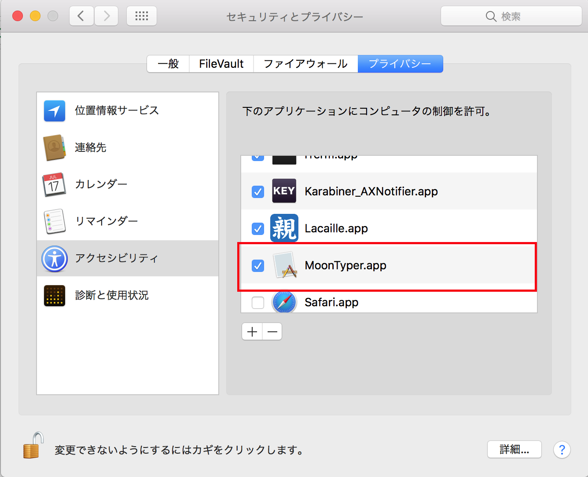

# 月配列エミュレータ

月配列でタイピングゲームを遊ぶためのエミュレータです。

月配列の入力キーを、ローマ字入力キーに変換します。

入力する文字が確定した時点ではじめて対応するローマ字のキーを発火します。濁点、半濁点は清音に後置の場合、「は」を入力した時点では「は」なのか「ば」なのか「ぱ」なのか確定しないため、「は」の入力後に何かしらのキーを押した際に初めて「は」（もしくは濁点を押した場合は「ば」）を出力します。


## 対応OS

- macOS Sierra 10.12以降

## インストール

TBD.

## 使い方

起動後アクセシビリティを許可してください。



メニューアイコンから使いたいキー配列を選択します。


タイピングゲームで高いスコアを叩き出しましょう！

## 設定ファイル

ホームディレクトリの `~/TsukiEmulator` ディレクトリ以下に [YAML](https://ja.wikipedia.org/wiki/YAML)形式で月配列の定義を置きます。

2-263の設定ファイルは同封しています。（自分はUSキーボードなので日本語キーボード用の定義は間違っているかもしれません）


```
name: "<表示名>"
keyboard: "<JIS or US>"
keymap:
  # 左が月配列で打つキー名、右がローマ字入力のキー
  "kf": "a"
  "df": "a"
  "i": "i"
  "j": "u"
  "du": "e"
```

## 補足

2-263でしか試していないため他の月配列の定義に現在の実装で対応できているかわかりません。

こういった点を含め不具合などはissueで報告いただけるとありがたいです。
